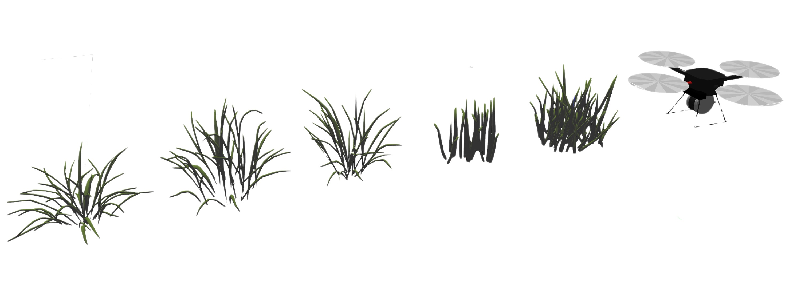
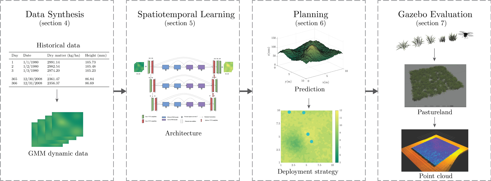
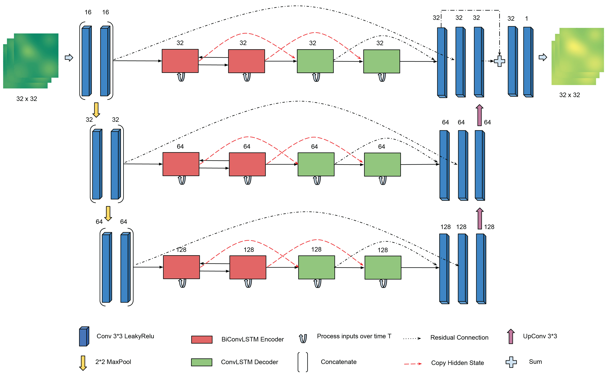
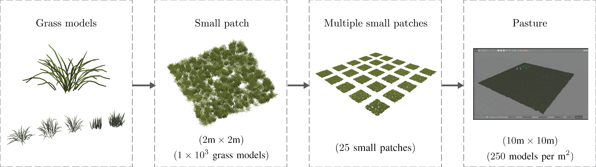
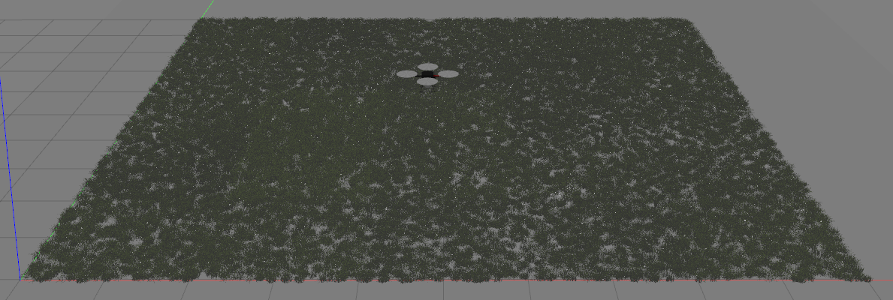
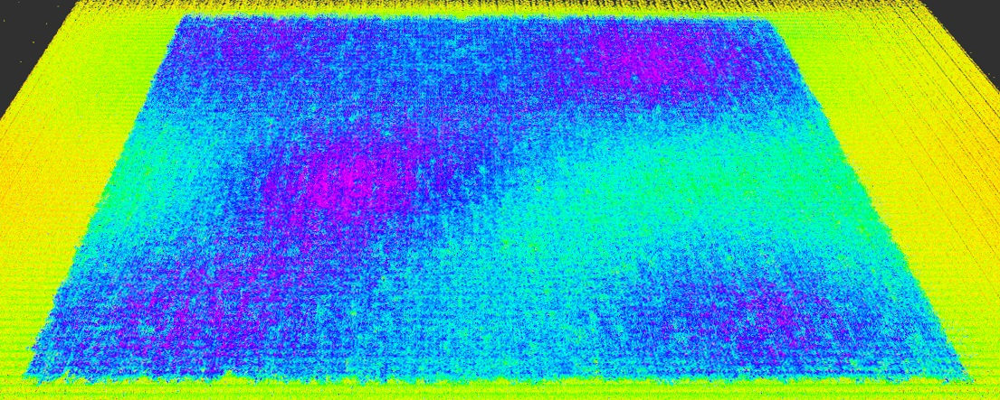

# Intermittent Deployment for Large-Scale Multi-Robot Forage Perception: Data Synthesis, Prediction, and Planning

arXiv: to be updated.

 
<b align="center">A diagram of our overarching solution.</b>

#### Abstract
Monitoring the health and vigor of grasslands is vital for informing management decisions to optimize rotational grazing in agriculture applications. To take advantage of forage resources and improve land productivity, we require knowledge of pastureland growth patterns that is simply unavailable at state of the art. In this paper, we propose to deploy a team of robots to monitor the evolution of an unknown pastureland environment to fulfill the above goal. To monitor such an environment, which usually evolves slowly, we need to design a strategy for rapid assessment of the environment over large areas at a low cost. Thus, we propose an integrated pipeline comprising data synthesis, deep neural network training and prediction, and a multi-robot deployment algorithm that monitors pasturelands intermittently. Specifically, using expert-informed agricultural data coupled with novel data synthesis in ROS Gazebo, we first propose a new neural network architecture to learn the spatiotemporal dynamics of the environment. Such predictions help us to understand pastureland growth patterns on large scales and make appropriate monitoring decisions for the future. Based on our predictions, we then design an intermittent multi-robot deployment policy for low-cost monitoring. Finally, we compare the proposed pipeline with other methods, from data synthesis to prediction and planning, to corroborate our pipeline's performance.

#### Keywords
Precision agriculture, intermittent deployment, planning, spatiotemporal prediction, deep learning.

## Flowchart

 
<b align="center">A diagram of the overarching solution.</b>

## Content
The project contains the following parts:

- [Data synthesis](Data_synthesis)

- [Spatiotemporal learning](Spatiotemporal_learning)

- [Planning](Planning)

- [Gazebo simulation](Gazebo_simulation)

 
<b align="center">A diagram of the pasture construction process.</b>

- [Evaluations](Evaluations)

 
<b align="center">A simulated 10m by 10m pasture.</b>

 
<b align="center">The corresponding point cloud.</b>

